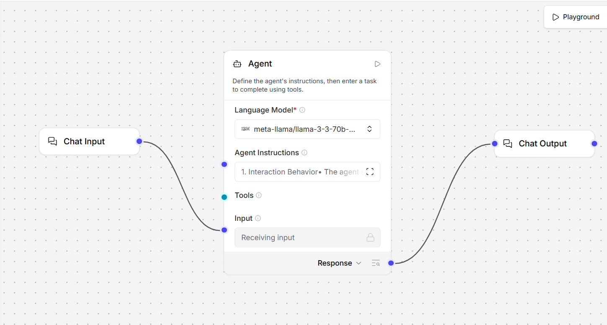
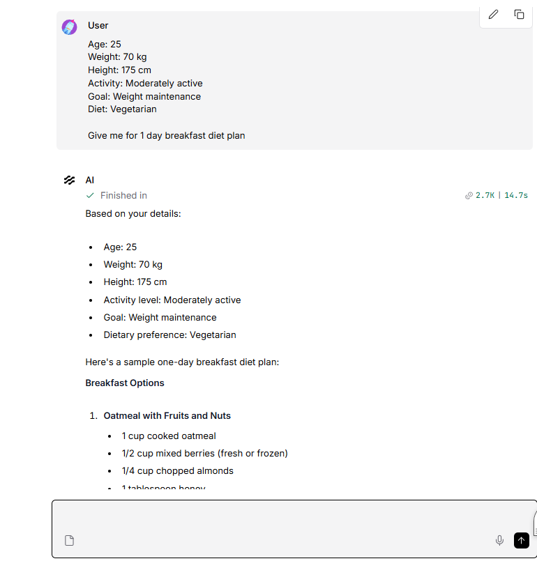

# Personalized Nutrition AI Agent

An AI-powered Personalized Nutrition Agent built using **Langflow** and **IBM watsonx.ai**.

## 📌 Project Overview

This project creates an AI Agent that collects user preferences such as age, dietary preferences, health conditions, goals, activity level, and location, and provides a personalized diet plan.

## 🚀 Technologies Used

- Langflow
- IBM watsonx.ai
- IBM Granite LLM

## 🔄 Workflow

User
↓
Chat Input
↓
AI Agent
↓
IBM watsonx.ai
↓
Chat Output
↓
Personalized Diet Plan

## ✨ Features

- Collects user information step-by-step
- Understands dietary preferences
- Considers user goals
- Considers activity level
- Considers location and food availability
- Generates a structured diet plan
- Provides healthy lifestyle suggestions
- Allows users to update their preferences

## ⚙️ Setup

1. Open Langflow.
2. Import the provided Langflow JSON file.
3. Configure the IBM WatsonX provider.
4. Enter your own IBM Cloud API key.
5. Enter your own watsonx.ai Project ID.
6. Select the appropriate IBM watsonx.ai endpoint.
7. Select an available IBM Granite model.
8. Connect Chat Input → Agent → Chat Output.
9. Run the flow and test it using Playground.

## 🔐 Security

API keys and other credentials are not included in this repository.

Users should configure their own IBM Cloud API key and Project ID.

## ⚠️ Disclaimer

This project provides general nutrition information and is not a substitute for professional medical advice.

Please consult a doctor or certified nutritionist for medical advice when appropriate.

## 👨‍💻 Project

Personalized Nutrition AI Agent using Langflow and IBM watsonx.ai.

## 📸 Project Screenshots

### Langflow Workflow

The workflow connects Chat Input to the AI Agent and then to Chat Output.

### Playground Output

The AI Agent collects user information and generates a personalized one-day diet plan.

